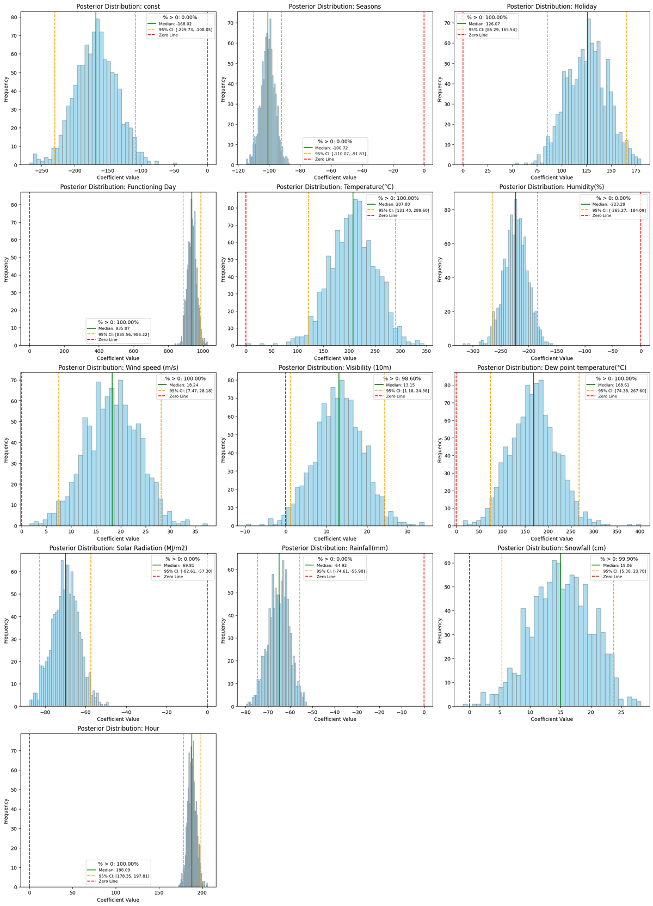
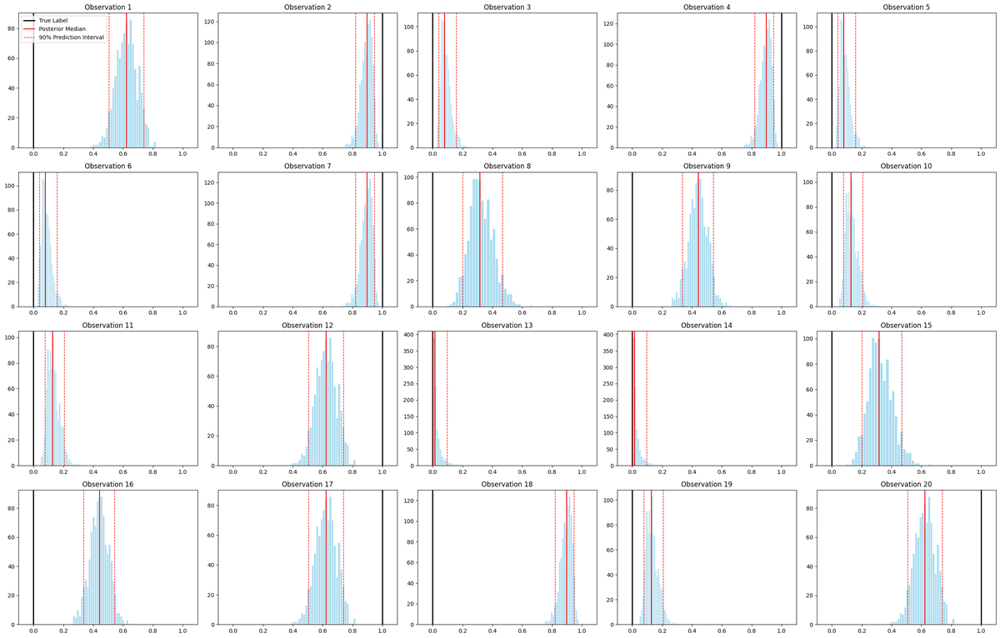
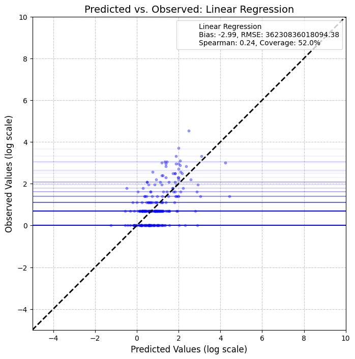
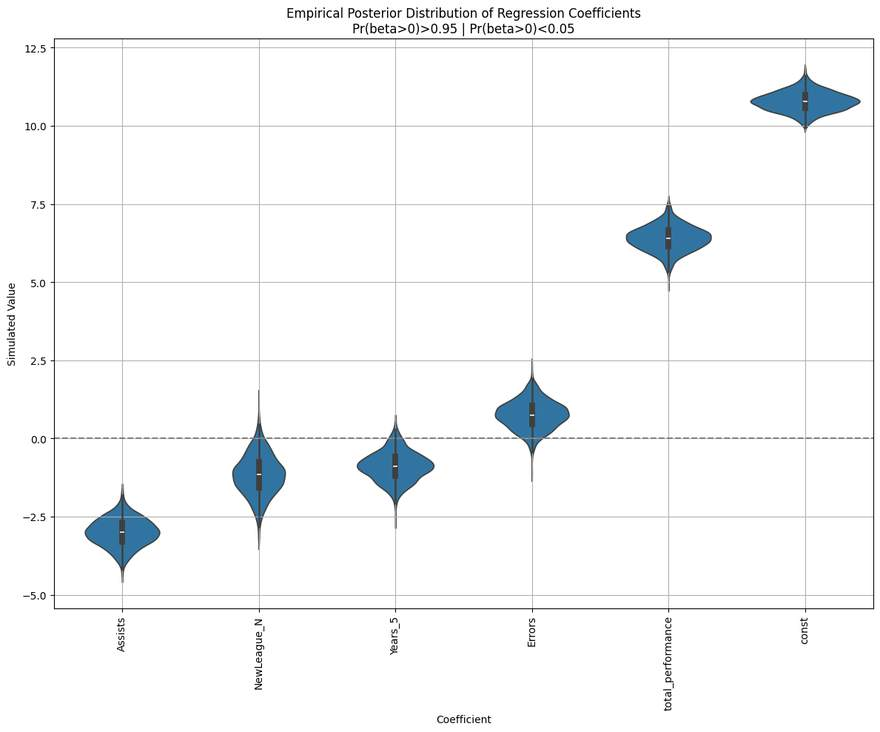
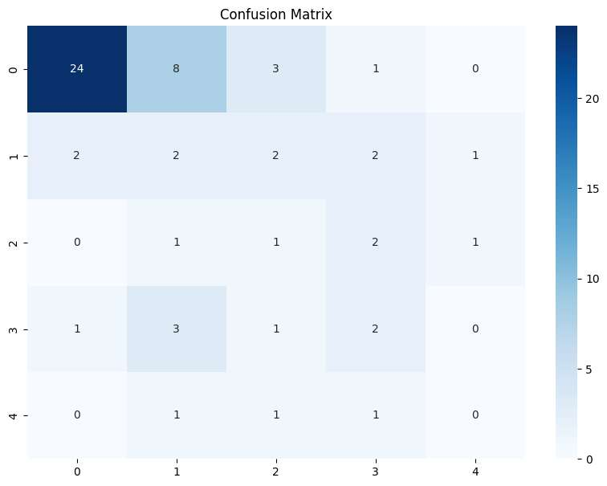
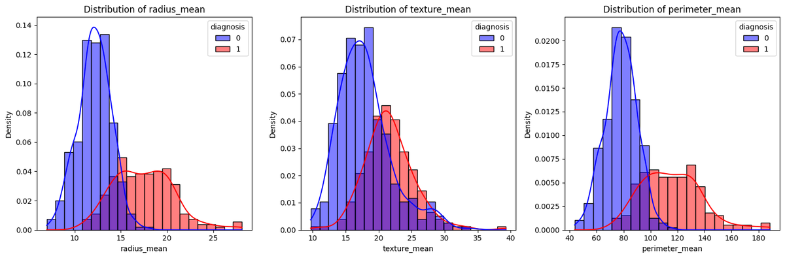

# Supervised Machine Learning

Regression and classification end-to-end — from linear models and **Bayesian inference** through
**regularisation**, **count models**, **gradient-boosted trees**, and a **neural network built from
scratch**, with disciplined **model evaluation** throughout.

**Techniques:** OLS · logistic regression · **Bayesian posterior inference** · Ridge / L2
**regularisation** · **Poisson** / log-linear count models · decision trees · **Random Forest** ·
**XGBoost** · class-imbalance handling (**SMOTENC**) · bagging / stacking / voting · **gradient descent
& back-propagation from scratch** · cross-validation · Brier score · VIF / multicollinearity

> ⭐ Start with **05 · Trees & Ensembles** and **06 · Neural Net from Scratch**.

| # | Project | Techniques |
|---|---------|-----------|
| 01 | [Regression & classification](#01--regression--classification-bayesian) | OLS · logistic · Bayesian posteriors |
| 02 | [Model evaluation](#02--model-evaluation) | k-fold CV · Brier · VIF |
| 03 | [Regularization](#03--regularization) | Ridge / L2 |
| 04 | [Count-data regression](#04--count-data-regression) | Poisson · log-linear |
| ⭐ 05 | [Trees & ensembles](#-05--trees--ensembles) | RF · XGBoost · SMOTENC |
| ⭐ 06 | [Neural net from scratch](#-06--neural-network-from-scratch) | gradient descent · back-prop |

---

### 01 · Regression & Classification (Bayesian)

Seoul bike-rental demand (OLS, **R²=0.55**) and SUV-purchase prediction (logistic, **85%**), each taken beyond point estimates into **Bayesian uncertainty** with 1,000-draw posterior simulation and 95% credible intervals.
📓 [Linear](01-regression-and-classification/linear_regression.ipynb) · [Logistic](01-regression-and-classification/logistic_regression.ipynb)

### 02 · Model Evaluation

Generalisation error done properly: train/val/test splits, **k-fold CV**, Monte-Carlo bias/RMSE/correlation, **Brier score**, and **VIF** across intercept-only / reduced / saturated models.
📓 [Numerical](02-model-evaluation/numerical_evaluation.ipynb) · [Categorical](02-model-evaluation/categorical_evaluation.ipynb)

### 03 · Regularization

**Ridge / L2** regularisation and OLS inference — shrinkage, bias–variance trade-off, coefficient paths.
📓 [Notebook](03-regularization/regularization_regression.ipynb)

### 04 · Count-Data Regression

**Poisson & log-linear** models for count outcomes — link functions, over-dispersion checks, rate-ratio interpretation.
📓 [Notebook](04-count-data-regression/count_data_regression.ipynb)

### ⭐ 05 · Trees & Ensembles

Decision trees → **Random Forests** → **XGBoost**, with pruning, class-imbalance handling (**SMOTENC**), and ensemble strategies (bagging, stacking, soft/hard voting) compared head-to-head on clinical & census data.
📓 [Notebook](05-trees-and-ensembles/trees_ensembles.ipynb)

### ⭐ 06 · Neural Network from Scratch

Logistic regression and a small **neural network implemented from first principles** — manual **gradient descent and back-propagation in NumPy** — validated against scikit-learn.
📓 [Notebook](06-neural-net-from-scratch/classification_from_scratch.ipynb)

---

## Tech stack
**Python** · scikit-learn · statsmodels · **XGBoost** · imbalanced-learn (SMOTENC) · NumPy · pandas · SciPy · Matplotlib · Seaborn

## Data
Standard UCI benchmarks (Adult Census, Heart Disease, Breast Cancer Wisconsin) are included so notebooks
run out of the box. Two large raw datasets (Global Terrorism Database, ~54 MB) are excluded — download from
[START/UMD](https://www.start.umd.edu/gtd/); notebooks keep their computed outputs.

## More of my work
`Other ML:` [natural-language-processing](https://github.com/jamie-dongjae/natural-language-processing) · [time-series-forecasting](https://github.com/jamie-dongjae/time-series-forecasting) · [unsupervised-and-causal-inference](https://github.com/jamie-dongjae/unsupervised-and-causal-inference)
`Capstone:` [Dream Space — Digital-Literacy Platform](https://github.com/jamie-dongjae/dream-space-digital-literacy-platform)

---
*Jamie Lee · BSc Computational Social Science, University of Amsterdam (2024–25)*
